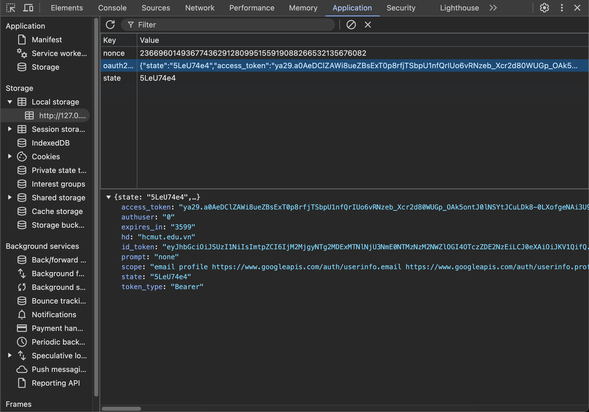
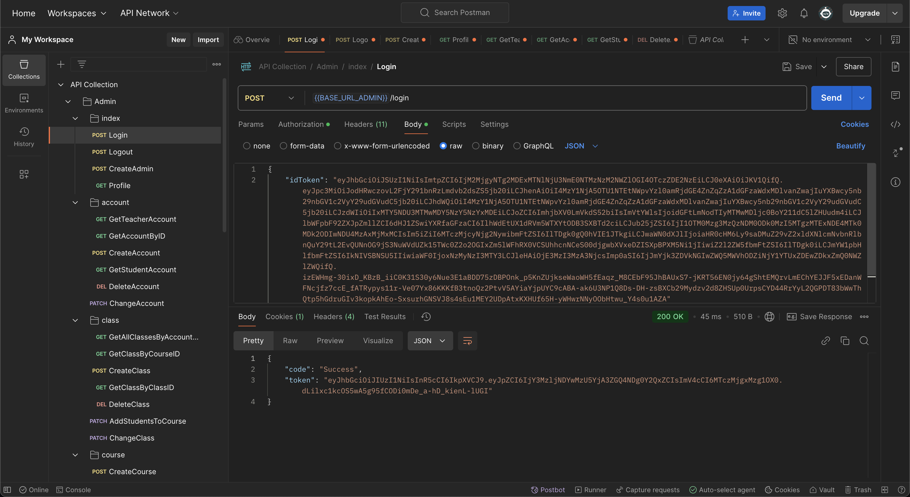

## CÁCH HOẠT ĐỘNG
### Index.html
- Chạy file `index.html`, chọn đăng nhập (Lưu ý chọn email có đuôi @hcmut.edu.vn)
- Bật DevTools và chọn `Application` -> Ấn vào oauth2 sẽ hiện lên id_token ở dưới.

- Copy id_token đó và dán vào phần `body: JSON.stringify({ idToken: "..."` của file `index.html`.

## Khởi chạy server
- Chạy MongoDB Compass -> Connection string nằm bên trong file `.env`
### Cách 1 : Chạy bằng docker 
- Khởi động Docker Desktop
- Build image bằng lệnh : `docker build -t go2:latest .`
  - Nếu build lỗi thì thử sửa bằng cách vào `cd ~/.docker` -> Vào file `config.json` -> Sửa `credsStored `thành `credStored`
- Chạy lệnh sau rồi vào localhost:8080: `docker run -d -p 8080:8080 --name go2 --env-file .env go2:latest`
### Cách 2 : Chạy bằng AIR
#### AIR giúp auto build sau khi code có chỉnh sửa mà không cần chạy lại lệnh go run main.go
- Chạy lệnh `go mod download`
- Chạy lệnh `air`
- Nếu ko chạy được thì thử lệnh sau :
  - `export PATH=$PATH:$HOME/go/bin`
- Server chạy trên localhost:8080/

### Test Feature bằng Postman Agent
- Truy cập trang `https://web.postman.co/`
- Import file `postman_api_collection.json` 
- Tải Postman Agent theo hướng dẫn -> Khởi động Postman
- Toàn bộ API + Function + Data cần thiết đều đã nằm bên trong.
  - Đối với Login thì cần gửi vào body idToken đã lấy được sau khi đăng nhập bằng oauth ở trang index.html

  - Tất cả những hàm còn lại đều cần Authorization (`Bearer token`) (được tạo ra từ JWT_SECRET + idToken) để phân role cho người dùng 
  - Phần token copy idToken vào
