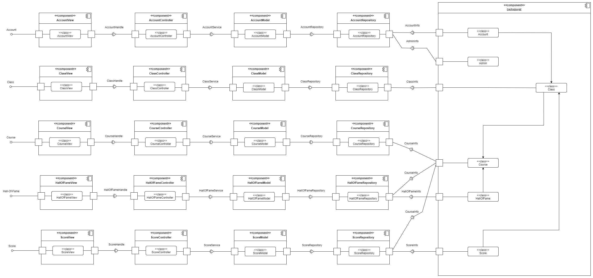
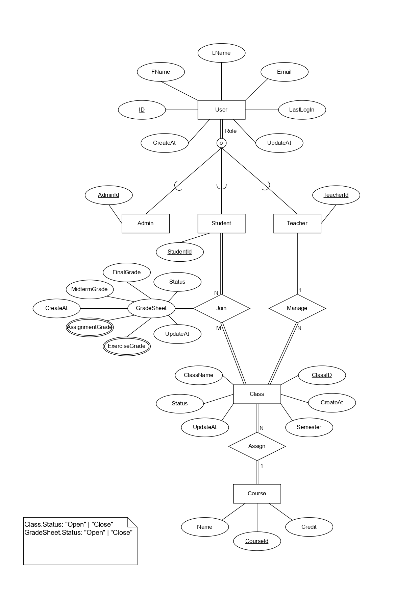

# Sơ đồ thành phần

### Các thành phần chính
- View: Giao diện sinh viên, giảng viên và admin, lớp học, khóa học và danh sách sinh viên có điểm số cao nhất. Riêng admin có giao diện tạo mới, sửa, xóa tài khoản, lớp học, khóa học. Khi người dùng gửi yêu cầu từ giao diện sẽ gọi đến dịch vụ ở lớp dưới.
- Controller: Tiếp nhận và xử lý các yêu cầu từ component View, sau đó chuyển yêu cầu tới các dịch vụ ở component tiếp theo.
- Model: Thực hiện các dịch vụ được yêu cầu và tương tác với kho dữ liệu để đáp ứng dịch vụ đó.
- Repository: Cung cấp dữ liệu cho các dịch vụ và thực hiện các thao tác trên cơ sở dữ liệu.
Database: Chứa các dữ liệu "tài khoản", "lớp học", "khóa học", "môn học", "danh sách sinh viên cao điểm nhất", các dữ liệu này phụ thuộc vào thông tin từ người dùng.
---

### Thiết kế CSDL

1. Trong layered architecture, database sẽ là lớp ở dưới cùng và sẽ chịu trách nhiệm lưu trữ toàn bộ data và xử lý chúng. Các dữ liệu của ứng dụng sẽ  được lưu trữ tại đây và các thao tác như search, insert, update and delete sẽ được thực hiện thường xuyên để thao tác với dữ liệu thông qua hệ quản trị cơ sở dữ liệu.
2. Đối với đồ án lần này, nhóm sẽ sử dụng kiến trúc lớp với database layer lưu trữ dữ liệu bằng MongoDB, một hệ cơ sở dữ liệu NoSQL, các kiểu thực thể cần thiết sẽ có các thuộc tính như trên hình.
