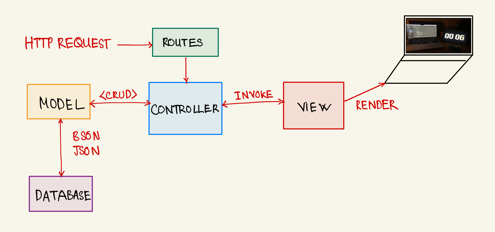
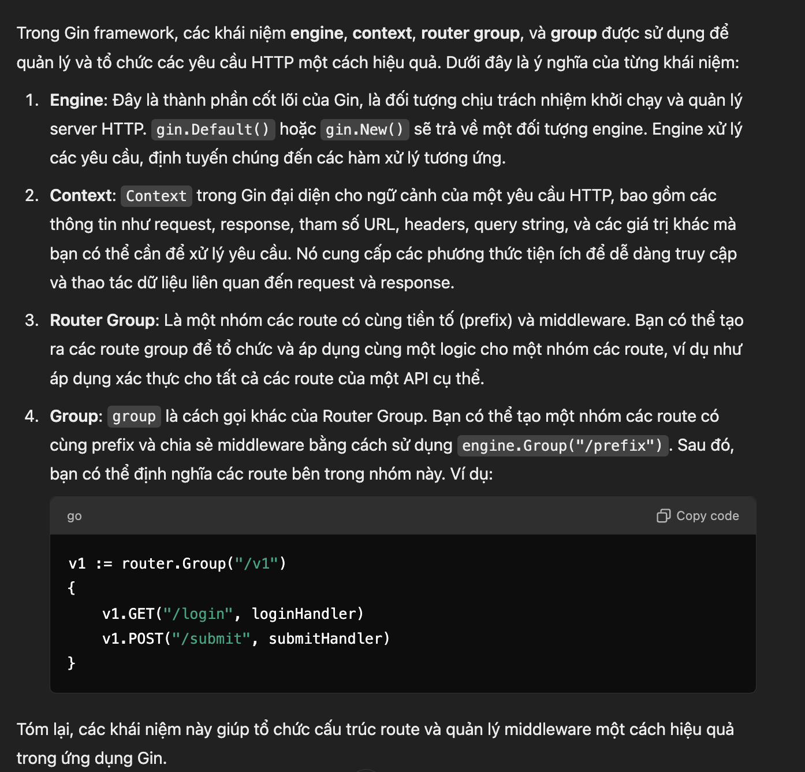
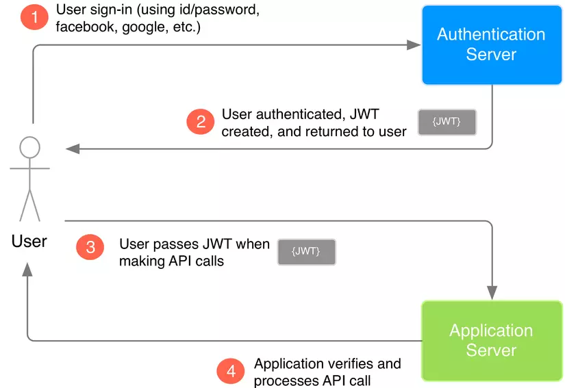

# MEETING MINUTES

### WEEK : `4`

# CÔNG VIỆC

- Hoàn Thiện Documents: `Deadline : 25/10/2024`
  - ERD.
  - Database.
  - Diagram _(Usecase, Sequence)_.
  - RESTfuls API _(POST, GET, DELETE, PUT)_.
- Hoàn thiện chức năng Admin (_POST_): `Deadline : 27/10/2024`.

| STT | Tên                 | MSSV    | Công việc          |
| --- | ------------------- | ------- | ------------------ |
| 1   | Chu Minh Tâm        | 2213009 | APIs               |
| 2   | Nguyễn Tiến Phát    | 2212527 | ERD                |
| 3   | Nguyễn Ngọc Diệu Hà | 2210846 | ERD                |
| 4   | Nguyễn Trọng Kha    | 2211417 | Database           |
| 5   | Lê Hoàng Bảo Hân    | 2210935 | Database           |
| 6   | Nguyễn Phúc Hưng    | 2211368 | Diagram (Use-case) |
| 7   | Huỳnh Thanh Tâm     | 2213012 | Diagram (Sequence) |

# HOÀN THIỆN CHỨC NĂNG ADMIN

### Admin:

- `Đăng nhập`: Cookie, Session, OAuth2.
- `Middleware` :

  - `Authentication`
  - `Validate`

  | STT | Tên       | Công việc                         | Hàm tương tứng     | API                            |
  | --- | --------- | --------------------------------- | ------------------ | ------------------------------ |
  | 1   | Hân       | Thêm `Teacher`                    | `CreateTeacher`    | `admin/teacher/create`         |
  | 2   | Hà        | Thêm `Student`                    | `CreateStudent`    | `admin/student/create`         |
  | 3   | Thanh Tâm | Thêm `Course`                     | `CreateCourse`     |                                |
  | 4   | Phát      | Thêm `Admin`                      | `CreateAdmin`      | `admin/create`                 |
  | 5   | Kha       | Thêm `Class`                      | `CreateClass`      | `admin/class/create`           |
  | 6   | Minh Tâm  | `Authentication` + `Login/Logout` |                    | `admin/login` + `admin/logout` |
  | 7   | Hưng      | Thêm `Bảng điểm`                  | `CreateGradeSheet` | `admin/gradesheet/create`      |

  **Sau khi hoàn thành chức năng `POST` của `Admin` sẽ tiếp tục thực hiện các chức năng còn lại (PUT, GET, DELETE), sau đó sẽ đến `Student`, `Teacher`.**

---
### MÔ TẢ API 

### CÁCH HOẠT ĐỘNG CỦA HỆ THỐNG

- `Route` :
  - Định nghĩa các `URL` và liên kết với các `Controller` tương ứng.
  - `Route` sẽ gọi đến `Controller` khi có một yêu cầu HTTP được gửi đến.
- `Controller` :
  - `Controller` xử lý logic của yêu cầu HTTP (GET, POST, PUT, DELETE). Nó nhận dữ liệu từ `Middleware`, tương tác với các `model` và trả lại phản hồi cho `client`.
  - `Controller` chỉ thực hiện các tác vụ logic như xử lý dữ liệu, gửi phản hồi, hoặc tương tác với cơ sở dữ liệu.
- `Middleware` :
  - `Middleware` là các lớp trung gian xử lý yêu cầu trước khi chúng đến `Controller` hoặc sau khi `Controller` xử lý xong. Nó có thể thực hiện các tác vụ như xác thực, logging, hay sửa đổi yêu cầu.
  - `Middleware` hoạt động như bộ lọc, giúp bảo vệ và kiểm tra các yêu cầu trước khi chúng được định tuyến đến `Controller`.
- `model` : xử lý logic liên quan đến dữ liệu (`CRUD`- Create - Read - Update - Delete). `Controller` gọi đến `model` để thao tác với `Database`.

- `Response` : sau khi `Controller` nhận data từ `model`, nó sẽ gửi phản hồi (responese) lại cho `client` thông qua các `route` ban đầu.
  Quá trình này
### Gin 

### `Authentication`

### JWT

